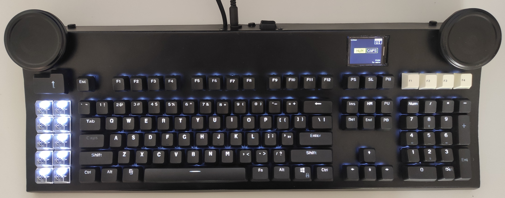

# FatBottomedBoard
_Ben's Custom Keyboard. Huge, large &amp; heavy board for everyday work._  
---
_"This is my definitive keyboard I'll use for my daily work"_. This phrase is pretty much the same
every keyboard builder reports and relates to her/his work. I spend most of my time in front of it and
as many others I'd like to customize few things. Project is nearly complete and the keyboard is
working fine but, as many other do, it's much more a work in progress and always improvable where new
features are constantly added. This is not a blog but just a repository where all stable features are
reported, released and shared to the public, hopefully you can contribute to it, pull request or add
features to the project as well.

---
## Notes on the project
- _"This is my keyboard. There are many like it, but this one is mine."_ 
   ([Cit](https://en.wikipedia.org/wiki/Rifleman%27s_Creed)).
- As written on the name this is _not_ a reduced keyboard like a 60-75% or a compact one. It's a fat,
black, bad ass, heavy & huge board for a big desk, it's not portable and it's not the keyboard you
pickup in a bag with your laptop. It's the kind of keyboard you always leave on your desk with your
trusty mouse and big monitors
- _"I already had some parts lying around"_. Another recurring phrase, but it's true. I dismantled two
acient AT/XT (switchable) keyboards I already had around and I discovered Cherry Black keys inside,
it's a real pity to throw them away and that's why I've created this project. Personal time and these
keys (lockdown helped too...) are main factors for the project
- **It has to be cheap.** Cherry keys are quite expensive but with these already sourced parts I've
decided to create a really cheap project without breaking the bank. Approx cost is now ~40$ , even
lower if you already have Teensy boards (like me) and you'd like to manually build something on your
own
- **No special tools required.** I don't have access to 3D printers, CNC or PCB machines so I basically
built it everything from scratch. Manually. I'm not a coachbuilder and some particulars are really
rough, I'm aware of it, but it's my keyboard. If someone would donate me a cnc machined kbd frame
I would be really happy to change that.
- **no kits, it's not _just_ an assembly work. Manually build, assembly, adapt, paint.**
If you're looking for another instructables.com project with some sort of kit purchasable on Amazon
this is not the keyboard for you. Everything here starts from scratch. Leds, keys/keycaps, MCUs and
you manually need to build or add everything else.
[Hardware buildlog](hardware/buildlog/README.md) and each step is
pretty well documented, drop me a note for everything else.
- Full _Metal_. Frame comes from manually carved, drilled, sanded, bended and adapted piece
of 3mm stainless steel. Some paint, a drill, files, a Dremel, nut and bolts... and your time...
- **Sun Type 5 was the best layout ever**. I was a big Sun Microsystems fan before obscurantism and
I think Type5 layout is outstanding. I started the keyboard with that layout in mind and I've added
my personal touch and improvements to that.
---

## Project features
- 119 vintage cherry black keys (1984-1988 period)
- Two rotary encoders with push buttons
- LCD color display for user functions, configuration, builtin macros, games, num/caps, layout switch.
  Screen saver function if inactive after a certain period of time.
- Builtin 1Gb SD card for keeping special macros/combinations(/passwords?)
- Two Teensy++ 2.0 boards inside, serial communication between them, source code provided
    * One dedicated to the keyboard matrix only, no dead keys, 20 Cols x 6 Rows.
      [QMK](https://qmk.fm/) opensource firmware, hooks and custom actions
    * One dedicated to the remaining features: LCD, rotary encoders, SD KeyPass, special macros,
      backlight control, games, layout switch, external configuration
- External 5V power supply so you don't need to rely on poor 500mA from USB host side, common ground,
  full control on backlight (PWM without polling) and USB
- PWM led (white) backlight. NumLock and CapsLock are driven by your host, other keys are manually
  controlled with PWM. Several modes available: Normal / AlwaysON / AlwaysOFF / InverseLock
- Black & Transparent backlight keycaps set
- Builtin 4 port USB switch, two ports are internally used for the Teensy boards, two externally
  available for other devices (phones, headsets, ...). Power consumption depends on your external
  power supply, your're not tied to USB limitations
- US International layout on host side, internally switchable layouts (with a dedicated key) for all
non native english speakers. Starts with a EN-US layout (linux rules on that) but you can type latin
(or non latin) accented letters for your language. Available layouts: EN-US/std, EN-US/int, IT/std.
Firmware extensible to any language
- Switchable OS (Linux: default, MacOS, Windows) [with a key combination] to enter special chars for
your favorite OS, no need to type unicode stuff (even if it remaps to it internally for some letters).
No keyboard drivers or special layouts are needed on the host side, just US-International on host side
- Two rotary encoders with push buttons. Customizable behavior. Now using: mouse scroll on right side,
password and macro keeper/scroller on left side. In setup mode right encoder is used to navigate menus.
- Builtin GAMES. Two rotary encoders and a small LCD screen ? Pong obviously ! More games coming btw..
  probably Arkanoid and other retro 80s games. There's a lot of space on Teensy++
- Special programs keys. Just like Type5 I prefer to have specific Cut/Copy/Paste keys and few more
  for most frequently used programs (need to map them on your OS)
    - Browser button, the big one below the left rotary encoder. Heavily used. (note: keycap from
    alternative bigass enter in the keyset)
    - Frequently used programs: Terminator, VisualStudioCode. Below browser button
    - Frequently used actions: Undo, Redo, Cut, Copy, Paste, Open, Close, Save
      in the left 10keys island
    - Gnome workspace desktop switch (1,2,3,4) for my taste, use whatever them you'd like.
      These are located below the right rotary encoder
- Play, Record, Custom macros with key combinations on each single key, courtesy of QMK firmware
- Ctrl,Alt,Super keys in this order. Just like MacOS cousins I really hate to have [SUPER] key between
  [Ctrl] and [Alt]. When I press in the middle I can send Ctrl+Alt or Ctrl+Shift+Alt with one finger.
- Special layout because I wanted it so (italian native here...). I don't like dead keys layouts and
  I want to use latin letters (è,é,ò,à,ù). Example: FN+E=è, RALT+E=é. So I still use standard us
  layout without worring too much. Same goes for € sign or other special chars as well.
  I prefer to keep US layout (which I love for sysadmin and programming) and enter additional chars
  from my language too when needed
- Large rotary encoder knobs. I want to use them from the side (just like DAS keyboards) or from the
  top (like a turn table). I did some video editing in the past and I still prefer large knobs. 
  _Those are not real knobs !_ They're just pot of jam lids filled with home made **Oogoo**. To me
  these are way better than traditional mouse wheels
- Software configurable from host side. With a python program you can upload a text file with
  custom macros to the keyboard SD card. With the left knob these macros are visible on the LCD
  display and selectable at will.
---

## Resources
- [BOM (Bill Of Materials)](BOM.md) available and up to date, links, costs and resources
- [Hardware buildlog](hardware/buildlog/README.md)
- Three basic sections
    - **[electronics](electronics)** Kicad schematics, pdf, lcd references and specs
    - **[hardware](hardware)** Frame schematics, credits, resource links and a photo buildlog. Everything is
    documented and photos are available to document the entire process
    - **[software](software)** keyboard (QMK with custom code) firmware and controller firmare (encoders, LCD,
    SD Card). Open source and available to everyone

## To Be Done
- Keycaps are still a work in progress (as every keyboard geek always says). Basic standard keyset
  is fine: looks cool, total black, custom backlight. But newly added keys in my 119 layout (10
  transparent and 4 white) are still a work in progress. I've bought transparent keys because
  I'd like to paint them black from the internal and carve them to keep backlight led with some
  custom signs
- Black Keyset is full PBT with variable heights (R1..R4), I'd like to add new R1..R3 transparent
  keys and replace part of the R4 keys (just placed there to fill the blank)
- Black paint from the inside and carve transparent keysets
- Replace white F1-F4 keys (taken from an old keyboard) below the right rotary encoder with custom
  made ones (backlight capable)
- Remove the Windows keycap with something else, I don't want it in my keyboard
- Add more games. Arkanoids, maybe Pacman and few more
- Audio capabilities to the Teensy (maybe). When you play Pacman is somewhat important :)
- Some login procedure or something to encrypt internal SD card content, I'm now using it to play
  some macros but I'd like to store passwords as well
---

## Contact me
Mail me, clone the project (but give credits), git pull request and improve the software in any way.
I'm available for consulting or just for sharing ideas with you. Links in my github profile as usual.
I really wish to improve the hardware part as well. A contribution but even few 3D printed parts are
well accepted

   
_Have Fun_  
_Ben_
