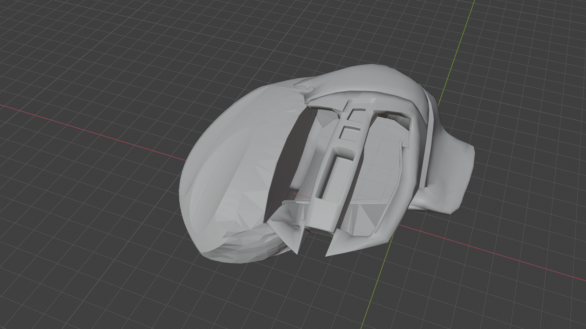

# BadAssMouse (BAM!)
Ben's custom made mouse.  
Thinked, engineered and built as a perfect companion for this awesome keyboard.
Huge footprint but light for fast movements, ergonomic and perfectly modeled on my right hand.

## Changelog

- **Revision 4**. Instead of modeling on a fully fledged mouse from internet this new version has been recreated
  totally from scratch and it's based on the shape of my hand only.   Weight and minimal points of contacts with
  the surface are also key factor of this new design.
- **Revision 3**. Cura sliced version, buttons in places, a lot of inner working on buttons thickness,
    internal palm support still in progress, external is fine but internal buttons shapes are not there yet.
- **Revision 2**. Lightly adapted print with better accomodations for the whole hand, fits well on my right hand
- **Revision 1**. First draft, 3d printed without buttons with overall shape to understand capabilities.
