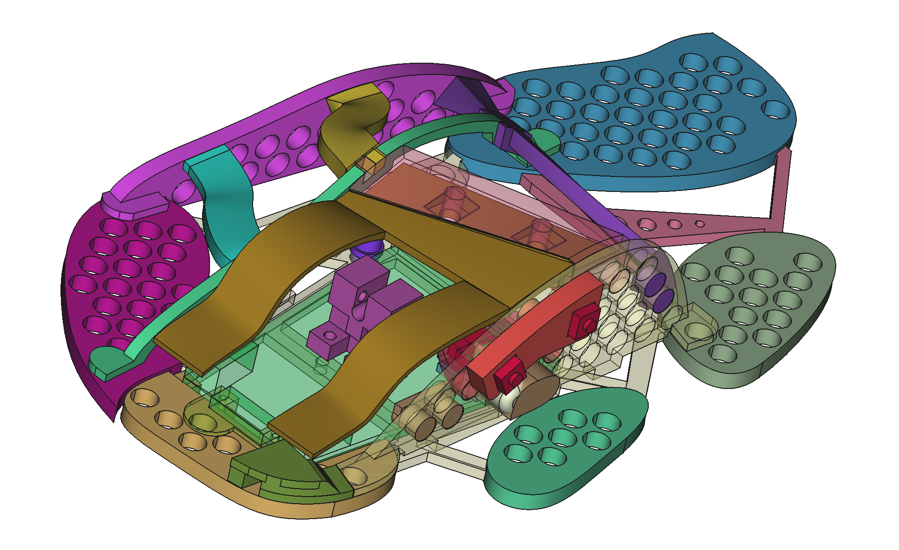

# BadAssMouse (BAM!)
Ben's custom made mouse.  
Thinked, engineered and built as a perfect companion for this awesome keyboard.
Huge footprint but light for fast movements, modeled for covering my right hand entirely.

## Feature List
- lightweight and usable. It's a ~80g device where electronics and spin wheel are around 45g alone, so it's not the lightest mouse in the world as I've seen diy devices below 20g
  but considering consumer's grade devices usually weighting around 170g is not that bad.
- Lightweight & Usable Design: This mouse is engineered to be both lightweight and practical for everyday use
- Ultra-Low Friction Glide  
  Experience a near-frictionless glide thanks to a unique raised design that minimizes surface contact
  - **Minimal Contact:** The mouse body is elevated approximately **3mm** off the desk surface, preventing the main shell from creating any drag
  - **Pinpoint Precision:** It touches the desk on only **very few strategically placed points**, with each contact point having a tiny surface area of just **1 square millimeter**
  - **Built to Last:** Constructed from durable ABS plastic, the frame is reinforced with **4mm thick pillars**. This robust design is the primary reason for its weight,
    but it also guarantees a solid, flex-free body that can withstand heavy use
  - **Effortless Movement:** This design and overall weight drastically reduces friction, allowing the mouse to move with minimal effort and maximum speed, feeling almost as if
   it's floating around
- Reliable, Recycled Internals  
The core of this mouse is built upon proven technology, giving it a reliable and high-performance foundation
  - **Logitech Heart:** The main PCB and all essential electronic components have been carefully transplanted from a classic **Logitech M500** laser mouse
  - **Proven Performance:** This approach leverages the quality and reliability of Logitech's sensor and engineering, ensuring excellent tracking and button response without reinventing the wheel
- Hyper-Fast 'Infinity' Scroll  
One of the most celebrated features of the donor Logitech M500 has been fully integrated into this build: the hyper-fast, dual-mode scroll wheel
  - **Effortless Navigation:** The scroll wheel can be toggled into a free-spinning "infinity" mode. With a single flick, you can coast through thousands of lines in documents, spreadsheets, or web pages instantly
  - **Dual-Mode Precision:** The mouse retains the ability to switch back to a standard, tactile "click-to-click" mode for when precision and line-by-line control are needed
  - **A Signature Feature:** This powerful and satisfying function is a direct result of using the M500's internals, bringing a premium, productivity-enhancing feature to a unique custom body
- Dedicated Thumb Button (Middle Click)  
To improve ergonomics and functionality, a custom third mouse button has been added, accessible to the thumb
  - **Ergonomic Placement:** This new button is positioned laterally on the side of the mouse, offering a much more comfortable way to trigger a middle click without altering your grip
  - **Enhanced Functionality:** While the traditional middle click obtained by pressing the scroll wheel is still available, having a 
    **dedicated thumb button** is far superior for actions in 3D modeling software (GIMP, FreeCAD, Blender, Cura, ...)
  - **User Choice:** This design provides two distinct ways to perform a middle click, offering flexibility and a better user experience overall.
- Horizontal Tilt-Wheel Scrolling  
Another powerful feature inherited from the Logitech M500 internals is the tilt-wheel functionality
  - **Side-to-Side Scrolling:** The scroll wheel can be tilted left and right, providing seamless **horizontal scrolling**
  - **Productivity Boost:** This is incredibly useful for navigating wide spreadsheets, timelines in video editing software, or large images without having to use horizontal scroll bars
- Hyper-Personalized Ergonomics: Function Over Form  
Let's be honest: this mouse wasn't designed to win any beauty contests (it's ugly as hell)
  - **Custom-Molded Fit:** The external shell is unapologetically functional, sculpted specifically to the unique contours of **my** hand. It may look ugly as hell, 
    but every curve and indentation is intentional, designed for a perfect, strain-free grip
  - **Comfort is King:** While its looks are unconventional, the result is a level of comfort and control that mass-produced mice can't possibly match.
    It's built for endurance and a seamless connection between hand and cursor.
  - **Truly One of a Kind:** This is the core philosophy of the project. It's not just *a* mouse; it is quite literally **'my mouse'**. 
    The design is a unique expression of personal ergonomics, creating a tool that is perfectly tailored to its one and only user.
- Modular, LEGO-like Construction  
The entire mouse is designed with a modular, "LEGO-like" philosophy, allowing for endless iteration and customization
  - **Snap-Fit Assembly:** All the structural parts of the shell are designed to connect using precise snaps. This allows for rapid, tool-less assembly and disassembly 
    during the design and testing phases.
  -  **Iterative Design:** This system makes it incredibly easy to experiment with different shapes and component layouts. Once I'm happy with the form, a few drops of
    cyanoacrylate glue are used to make the connections permanent and rigid.
  - **Infinitely Reshapeable:** The core principle is flexibility. The mouse isn't a final, static object but a platform that can be easily broken down, modified, and
    rebuilt in a completely new form whenever desired.
- 3D Print Files and design available  
All the 3D models required to print your own version of this mouse are available in this repository
  - **Files Available:** You can find all the `.stl` design files ready for slicing in this directory
  - **Recommended Material:** ABS is highly recommended to match the sturdiness and durability of the original design. PLA can be used, but may be more brittle

## Pictures
  
Its ugliness, in real life

  
Floating on the desk

  
middle/thumb button, back and forward buttons (silent micros, low stroke)

  
Mouse covers the entire hand up to the wrist

  
Every finger is differently raised for ergonomics

## Support the Project
If you've enjoyed this project and would like to support its future development, thank you! Every little bit helps and is incredibly motivating
- **Fund the Next Version:** The dream is to create an even lighter and stronger V2 using **carbon fiber filament**. If you'd like to help make that a reality,
you can [buy me a spool of filament directly](link-to-your-wishlist) or contribute towards the cost
- **Contribute Financially:** A small donation to help cover prototyping costs is always welcome. You can do so via [**PayPal**](paypal.me/bendonations)
- **Share the Project:** If you can't contribute financially, no problem at all! A star on the repository or giving project attribution when you share or use
the design is a fantastic and highly valued way to show your support

## Changelog

- **Revision 4**. Instead of modeling on a fully fledged mouse from internet this new version has been recreated
  totally from scratch and it's based on the shape of my hand only.    Weight and minimal points of contact with
  the surface are also key factors of this new design.  Electronics from M500 because I still have some of them.
- **Revision 3**. Cura sliced version, buttons in places, a lot of inner working on buttons thickness,
    internal palm support still in progress, external is fine but internal buttons shapes are not there yet.
- **Revision 2**. Lightly adapted print with better accomodations for the whole hand, fits well on my right hand
- **Revision 1**. First draft, 3d printed without buttons with overall shape to understand capabilities.
