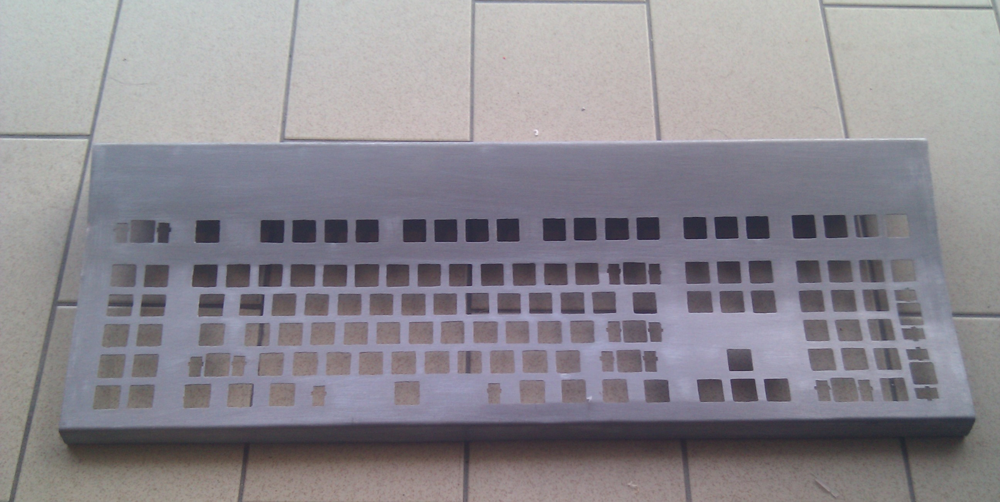
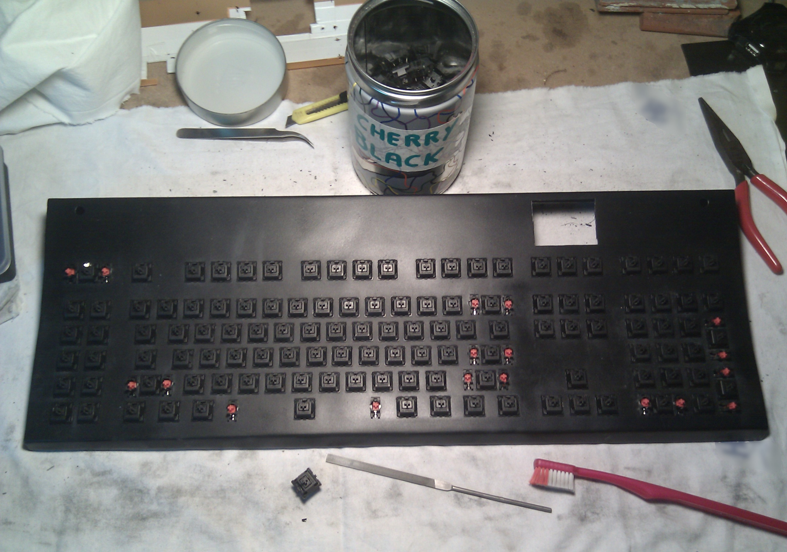

# Build Log
This is a basic build log, it's not a blog yet but feel free to ask if you want additional
documentation or something more than just few steps and some photos. I've never published
a video for it so if you prefer to have something better just ask.  

Here are just basic steps and keyboard making in a long journey, I've worked on it in my spare time
and when cheap (or free) materials were available. This is just a basic photo doc.  

---

### It all started with a scrap piece of metal
With a cheap 2mm stainless steel sheet and my jig saw I've cut keyboard base plate, basic keyboard
shape has been created with classic http://www.keyboard-layout-editor.com/. All link and resources
are readily reported in this project as well

A basic cut and some sanding on the edges. With a drill I've placed holes where necessary and with a
cutter and my files I've shaped proper key housings. This is not a difficult operation, just a little
bit boring but it's still easy.

With a marker I've painted key housings, on the left there're few completed squares, in the
middle few of them are drilled, on the right a lot of work has to be done.
Still boring but quite easy too.

After a long while and a lot of repetitive job with small files I finally have some nice metal
artifact. If you're on the cheap and you don't want to waste money on CNC machining this is what you
can do, if you've some money and you can afford a professional work is up to you to get something
better. DXF, EPS and full specs are available

After a lot of refining work with my files I've bended it with a squared steel bar. I've started
from the bottom in order to keep clean folds, I've avoided to use an hammer because I don't have
professional squaring tools. Take your time (and your patience), you cannot do a fold twice.

On the back there's an experiment I've done with threaded rods and metal putty in order to 
strengthen the chassis but:
- there's no need to strengthen a steel frame, it's still sturdy and solid even without them
- my metal putty and stainless steel don't match at all, even after several days these two materials
weren't perfectly linked. Result was really poor so I've removed them after a while
- it really sucks, honestly, don't do that. Lesson learned

After removing the rods I've finally gently bended the upper plate a little bit more (with a towel)
in order to have a clean and nice curve (like Type5). There's no rule of thumb, it's just my flavor.
I've finished when I was happy for it.  
After that I've removed original black painting and I've sanded a lot (40,100,150 grit), stainless
steel might be hard to paint when it's not properly sanded

It's not too smooth in order to avoid problems with paint or primer but it's clean enough to correct
previous defects and remove previous color.
In this photo you can clearly see the U-shaped fold on the front and light bending at the base plate

After sanding I've applied some
[Oogoo](https://www.instructables.com/How-To-Make-Your-Own-Sugru-Substitute/)
on the inside to fill the gap for future enclosure. My version also has a small part of neoprene
glue for extra hardness and better cohesion with metal. It's still quite soft but it's like some
kind of hard rubber. This part is the key for keeping the back plate in place.

Due to its adaptability I've applied some oogoo for shaping sides as well, it's like doing some
mold but due to its strangthness it's a perfect material for filling gaps. This time I've also
added some black toner to the mix in order to have a black shape. With a small piece of steel
I've simulated the back plate so the side is perfectly shaped. Neoprene glue accelerates the
oogoo chemical reaction and it dries quickly, you've to be fast to apply the mixture.  
When it's dry you can remove excess parts with an utility knife. You don't have to be too precise 
on the inside. On the outside I've used a Dremel to perfectly sand it before painting.

This oogoo is really solid even if i've added some epoxy glue on borders to keep it in place.  
The dremel is the perfect tool to shape this material even if after some sanding the color tends
to be light grey, fortunately it keeps spray paint really well.  
I've also attached squared bars with nuts inside it and fixed with bolts, this would keep the back
plate in place.

Stainless steel is hard to paint when it's not clean or not sanded enough. To avoid troubles I've
also applied a coat of primer. It's a zinc-coated primer I've previously used as base for a
cast iron stove painting. It's a raw color and it's a little bit thick but that's ok. I'll use this
primer as plaster to cover steel imperfections.  
From this photo you can see holes on both sides, this is where rotary encoders will be placed.
There's a big square hole on top where the LCD display will go.

More sanding over the primer. I've sanded with 180 and 220 grit over the primer to have a uniform
coverage, even if some primer has gone it's not a problem at all. I'll add another coat of paint
to protect the steel.

I see a keyboard and I want to paint it black...  
Now with a spray can I've covered it with first coat of black paint, result seems to be good even if
it's a cheap spray can and I'm not a coachbuilder nor an experienced pro with colors.

In this photo there are two different things.  
In order to avoid short circuits I've recycled plastic films from cellophane bags, I'll cut them
later on with a surgeon's knife.  
The orange part is polycarbonate, this will keep plastic films in place and the keyboard circuits
insulated from the steel. I have also created some space for the USB hub and the power jack in the
middle of the board

Now with a spare piece of metal (was a hard disk bracket) I'll keep the polycarbonate in place and
I'll also add some sturdiness around external usb ports and power supply jack. Handsaw a drill and
some files, as usual...

Now it's time to work on the display. These cheap arduino LCDs also have SD card storage.
I've had planned to use I2C ROMs and connect them to the Teensy but this SD slot seems to be a
really good opportunity. You can see full specs on the circuit in the dedicated section.
The only problem I've it's the size of the SD card.
SD Card inserted in the slot collides with the cherry keys so I've cut the card to save space,
this is an old trick I've learned from Raspberry Pi forums and it's still valid.  
**2Gb SD card** is a lot of space for saving keyboard macros and since it will be mainly used for
reading (storing new macros is still possible but not that common), I think it's a good solution.

Circuit has been built on a protoboard, through-hole components commonly available, no smd parts.
Something you can easily obtain locally or you've already in your bench. As usual see the circuit
specs of the project for further details.  
From the picture two rotary encoders are connected to the Teensy. Knobs are temporary for testing
purposes

More painting (three coats of black paint totally) to obtain a matte effect, I
personally don't like a shiny effect, also because it gets scratched quickly. A quick coat with a
transparent varnish and I finally have something to work on.  
The whole world use PCB mounted stabilizers, I cannot use them so surface mounted stabs are
my only option. Costar are noisy but easier to mount on, Cherry stabs are a real pain to mount.
With a caliper I also have measured plate thickness and it's now 3mm width so slightly thicker than before.
These stabs are fine on 2mm _aluminium_ plates, 3mm steel is a madness. Take your time and act wisely
in order to avoid scratches or damage the plate.

Zooming on stabs and holes is interesting because square holes are not so perfect anymore and stabs
are not properly aligned.    
Stabilizers positioning is easy because you can fix them with a file and even if they're moving
a little it's not a problem because when keycap is applied they won't stuck, they just need to be
lubed to avoid rattling.  
Square holes are rough due to painting deposits and this is absolutely a boon, Cherry keys will
stick on that like a gasket. Remove excessive tailing (if any) with a file, not my case here.

Placing keys on the plate is the only fun part of this process, this is what I see often when
I look at other tutorials where someone bought a kit with everything and they just need to
assemble ready made parts... well, it's not my case.  
I'm using Cherry Black keys as reported in the BOM. These keys are part of two acient AT/XT
keyboards I've had around for a long time. Manufacturing date reported on those keebs was _1988_
so I guess these keys are probably from the 1984/1988 period. There's a lot of discussions related to
original and newer cherry keys, I couldn't be happier for them. Black series are fully linear,
ultra silent, without udible click and mostly recommended for gaming, I love them

Now it's time to use the surgeon's knife to adapt the thin plastic foil with square holes for the
keys, it takes a lot of time but not a problem at all. Small dots of mastic will keep the plastic
glued to steel, it doesn't has to be nice, it just works

Now the real mess: manually handwiring everything, 20 cols x 6 rows (119 keys). It takes a lot of
wirewrapping wire (no, I don't have different colors for it) and a lot of patience. With a plan
(you can see the print there) it's just a matter of days.... I envy 40/60/75% builders in this
case this one is really huuuuge

Now it's time to place the polycarbonate sheet and block it in place. It will keep its position
thanks to two rotary encoders (on both sides) and with the metallic bracket where PSU jack and 
USB Hub are placed. Hub has 4 ports, two are used on the inside with two Teensys, two are
accessible from the outside for your favorite peripherals (cellphone, tablet, headset, ...).  
USB Hub has been slightly modified by cutting the power pin coming from Host. Host and this hub
have common ground and data pins but power supply has been taken externally from a dedicated
PSU jack (5V). From the same connector power supply will be granted for the entire board
(Teensy, led backlit, LCD, external USB peripherals). Use whatever 5V external PSU you have, in my
case I've used a 5V 2A unit.
See picture above for further details

Time to cut some cables, adapt wirings and place Teensy boards.  
Here's some clean wiring with Rows and Cols connected to one of the two Teensy controllers
(on the left), this has the QMK firmware loaded and direcly controls the keyboard matrix
(20x6, no ghost keys).  
On the right side another Teensy board controls: rotary encoders, LCD display, SD Card, led backlight
and has access to the same USB hub, so it's like having two keyboards in one shell.  
These two Teensy are connected together with TTL serial port (Arduino __Serial1__) and exchange data,
configurations, display information and so on. I'd like to protect SD card data so I've thought about
a potential login process at startup or a way to input user data after boot

To control led backlight I'm using a Darlington Transistor (see BOM) in order to avoid direct driving
from the MCU. TIP112 is more than enough for my LEDs because I won't use them at maximum light, for
the same reason the heatsink is not necesary but it's better be safe than sorry, as usual.  
Connectors don't save space and manual wiring is always better but with this method I can
disassemble or enhance the project without troubles

So you think I'm set with manual wiring because the keyboard is now working ??? **Wrong**.  
Now it's time to start some real pain with led backlight wiring. There's no polling nor multiplexing,
each single led will be driven by the Darlington Transistor.  
Only two leds are driven directly from the Teensy: _Num Lock_, _Caps Lock_. Under the teensy board
(upper left) there's a piece of heat shrink tubing with two resistors, these are connected to the
two leds and the MCU.  
Every other key on the board has a led, a resistor in series with it and a connection to the
Darlington. Now you'll start seeing a lot of wiring mess, resistors and heat shrink everywhere

There's a lot of wiring, patience, madness, resistors and heat shrink tubing. Take a look at the
next photo with wiring without backlight (left side) and with backlight (right side)

Now it time to test all this stuff, after carefully assembling everything and a quick test I finally
ended this crazy thing. There are tens of meters of cables in there. You better have a lens for
this kind of work

Now the fun part with keycaps. Pay particular attention to large keys with stabs, place them 
before everything else, it won't be easy to put them later if you make mistakes or if you've
problems with stabilizers placing.
When you're confident with these large keycaps and stabs are not rattling you can place other 
keys too.  
If you're building an average keyboard like me you already know you've to lube keys and stabs. I've used some lube for stabs (let the flamewar begin) and Oil from sewing machines for each single key.
If you're building a top class keyboard you're already familiar with chemicals and probably you've
already spent 10/20 bucks for top class lubricant.  
Now a small note on knobs: these are not real knobs. I'd like to have a 40/50mm knob and 30/35 are
too thin for me. I don't have access to a 3D printer and that's why I've used jar caps. These
caps were black painted and filled with oogoo (on the inside) to have some weight and keep the
rotary encoder screw firmly placed in the middle

Before placing the backplate in place I've added some adhesive paper to avoid short circuits.
Zoom the photo and take a look at the borders for further details. A steel frame is awesome but
it requires extra precautions

### Finally, something usable
Yes I finally did it, real photo from a cellphone, not photoshopped (gimp: "crop to selection" only)
to center the subject but nothing more. Now it works I'll surely improve the software but the hardware
side is almost complete. **Is it finished ??  No, it's not**  
Basic keycaps are fine but my keyboard requires extra keys and I want to keep the same style.
I've placed F1...F4 keys below the right encoder just to fill the blank. Hopefully I'll replace them
real soon. On the 10keys island on the left side I've placed 10 R4 keys because I'm still waiting for
R1,R2,R3 keys from AliExpress.  
I'm buying transparent keycaps because I want to paint them black from the inside and then carve
letters or symbols (from the inside too), painting on the outside with nitro or acrylic is not
preferable because your fingers will have a different feeling with them. Even more, after a short
while painting goes by.  
**Windows key is pure evil.** I need to buy something different for the right "super" (or meta) key

Rotary encoder knob is really cool even if it's just a jar cap. Filling it with Oogoo sounds nice
because when you use it it feels quite heavy and it doesn't swing at all.  
**UPDATE:** replaced them with big fat self made wooden knobs, see 
[try, build, fail, repeat...] section below  
Browser button (big fat enter placed horizontally) was just a filler because I didn't have a 2U
keycap but I really like it, I won't replace this key.  
R4 transparent keycaps are nice in the first two rows but inappropriate on the remaining lines,
as described above I'd like to have a full line: R1, R2, R3, R4 keys, black painted and properly 
carved so still a work in progress

Display is fine, I've black painted the borders but I still need to place a small filler mask to
to avoid minor external light effect, not that bad anyway

Right side view. Black painted Oogoo is nice. At the base level you can see small felt pads raising
the keyboard by few millimeters, without them the keyboard could scratch the desk

Another overview of the board. On the top you can see the USB cable, the power supply cable and
two usb ports. No visible screws or other joints on it

Keyboard firmware is basic but fully working, not good looking but fonts are crisp and clear, 
things are visible and hopefully I'll dedicate some time on it
- "main" screen: numlock, capslock, OS type, current keyboard layout
- "main menu": overall configuration of Host Audio, Backlight, Kbd/mouse settings, Games
- "led backlight": you can make it bright or totally off, PWM controlled from MCU
- "macro mode": with the right knob you can enter repetitive key sequences (macros menu selectable)
- "audio volume": to control host audio with a knob
- "PONG": Two rotary encoders ? Pong obviously. There's more on the way (Arkanoid, Pacman)
- "setup": Scroll size, inactivity time, firwmare upgrade and so on  

Encoders are big and used to control the display but also usable for host interaction (mouse wheel,
X/Y axis, volume control, ...)

**try, build, fail, repeat...**  
I really like these big knobs and recycling two jar caps seems to be easy and quite good, overall profile is smooth
and they nicely do the job but I'm not completely satisfied yet. I've decided to create something heavier and tall,
something like those giant knobs I usually see on professional video editing consoles.  
From scrap wood (as usual...) I've created a big knob with just a drill and a file (unfortunately I don't have a lathe),
it's rather big (70x25mm !) and I really like it, I've applied the same black spray color after two layers of primer.  
It doesn't even seems to be wood after the black paint, see for yourself

