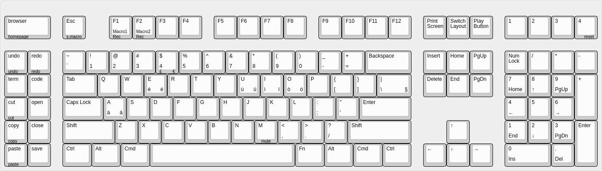

# Keyboard manual _(BABE)_

Here you can see the complete keyboard with silk-screen keys

---

## Host configuration

Just _one_ simple rule: **SELECT US-English Keyboard Layout. That's it, no more, no less.**  

There's no need to use US-International, language packs or additional layouts on the host side.  
Each operating system has its own ways to enter latin characters (á,é,í,ó,ú, ...), I've tried to
skip dead keys layout, US International sounds cool but it's a mess if you'd like to enter ',",`,...
Windows particularly sucks on this aspect and many users created
special keyboard layouts to override US-Intl behavior with dead keys, there's no need for that.

## Special inputs characters
| Combination                   | Result                        | Example or Notes|
|-                              |-                              |-|
| _Special Characters_ |||
| **\<FN>**+**_\<letter>_**     | [**`**] Grave accent letter   | FN+e = è |
| **\<ALT>**+**_\<letter>_**    | [**´**] Acute accent letter   | ALT+e = é |
| **\<ALT>**+**_<4>_**          | [**€**] Euro sign             | _where **$** sign is reported_ |
| **\<FN>**+**_<4>_**           | [**£**] Pount sign            | _where **$** sign is reported_ |
| **\<FN>+\<\\>**               | §                             | § |
| _Editing Functions_ |||
| **\<UNDO>**                   | Ctrl+Z                        | Generic undo key |
| **\<REDO>**                   | Ctrl+Y                        | Redo with Ctrl+Y (vscode) |
| **\<FN>+\<REDO>**             | Ctrl+Shift+Z                  | Redo with Ctrl+Shift+Z (eclipse) |
| **\<CUT>**                    | \<Ctrl>+\<X>                  | Cut |
| **\<FN>+\<CUT>**              | \<Shift>+\<Del>               | _cut_  _(classic)_|
| **\<COPY>**                   | \<Ctrl>+\<C>                  | Copy |
| **\<FN>+\<COPY>**             | \<Ctrl>+\<Insert>             | _copy_ _(classic)_|
| **\<PASTE>**                  | \<Ctrl>+\<V>                  | Paste |
| **\<FN>+\<PASTE>**            | \<Shift>+\<Insert>            | _paste_ _(classic)_|
| _OS Features_ |||
| **\<Browser>**                | Start chrome browser          | Mapped to LSFT(KC_F20) on OS  |
| **\<FN>+\<Browser>**          | Browser Home (Windows)        | _#define KC_WWW_HOME_  |
| **\<FN>+\<M>**                | Volume mute                   | _#define KC__MUTE_ |
| **\<SwitchLayout>**           | Toggle keyboard layouts       | **EN**:US English, **IT**:Italian, **UI**:US International|
| **\<FN>+\<SwitchLayout>**     | Toggle OS                     | Toggle OS (Linux, MacOS, Windows) |
| _Macro Functions_|||
| **\<PlayButton>**             | Layer for macro input         | Toggle layer for playing macros |
| **\<FN>+\<F1>**               | Record MACRO1                 | Start recording MACRO1 |
| **\<FN>+\<F2>**               | Record MACRO2                 | Start recording MACRO2 |
| **\<FN>+\<ESC>**              | Stop recording macro          | Stop recording previously started macro (if any)|
| **\<PlayButton>+\<F1>**       | Play recorded MACRO1          | Execute recorded MACRO1 |
| **\<PlayButton>+\<F2>**       | Play recorded MACRO2          | Execute recorded MACRO2 |
| _Firmware Functions_|||
| **\<FN>+\<WS4>**              | Reset keyboard                | boot loader for firmware upgrade |
**NOTES:**
- **MACRO1**, **MACRO2** can be created/modified at runtime but are volatile, they're lost when
keyboard is turned off
